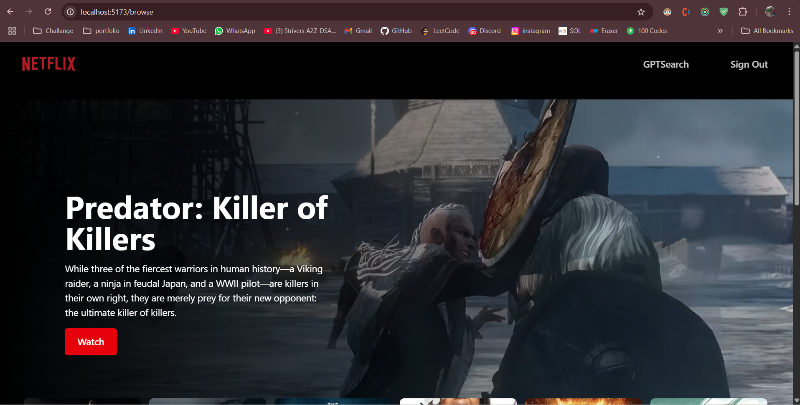
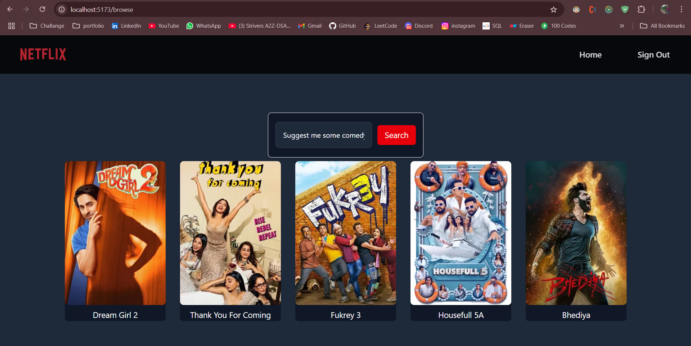

# NetflixGPT 🎬🔍

**NetflixGPT** is a smart movie recommendation web app powered by **Google Gemini AI**. It provides intelligent movie suggestions based on user queries and displays trending movies from **TMDB**, all styled with a Netflix-like UI.

---

## 🔗 Live Demo

👉 [Visit the Live App](net-flix-gpt-neon.vercel.app).  


---

## 📸 Screenshots

>
  


---

## 🚀 Features

- 🔎 AI-based movie recommendations using Google Gemini
- 🧠 Natural language search like “Suggest horror movies”
- 🎬 Displays trending movies from TMDB
- 🔒 User authentication with Appwrite
- 💬 Loading indicators & input validation

---

## 🛠️ Tech Stack

| Layer          | Technology                            |
|----------------|----------------------------------------|
| Frontend       | React.js, Redux Toolkit, TailwindCSS   |
| Backend/Auth   | Appwrite (Authentication + Sessions)   |
| AI Integration | Google Gemini API (via GenAI SDK)      |
| Movie Data     | TMDB API                               |

---

## 📦 Installation

### 1. Clone the repository

```bash
git clone https://github.com/Priyanshu-Bhriguvanshi/NetFlixGPT.git
cd NetFlixGPT
npm install
```
### 2. Create a .env file and add your keys:
```bash

VITE_APPWRITE_PROJECTID = your_project_id
VITE_APPWRITE_DATABASEID = your_database_id
VITE_APPWRITE_COLLECTIONID = your_collection_id
VITE_APPWRITE_BUCKETID = your_bucket_id
VITE_TMDB_ACCESS_TOKEN = your_access_token_from_tmdb
VITE_TMDB_API_KEY = tmdb_api_key
VITE_GPT_API_KEY = your_gemini_api 
```
### 3. Run the development server
```bash
npm run dev
```
## 🙋‍♂️ Author
- Priyanshu Singh
- 📍 India
- 🌐 [Connect on LinkedIn](https://www.linkedin.com/in/priyanshusinghdev/)
